## FNN
### Definition
Feed forward Neural Networks are artificial Neural Network which nodes do not form loops. This type of neural net works is also known as a multi-layer neural network as all info is only passed forward.
During data flow, input nodes receive data, which travel through hidden layers, and exit output nodes. No links exist in the network that could get used to by sending info back from the output node.

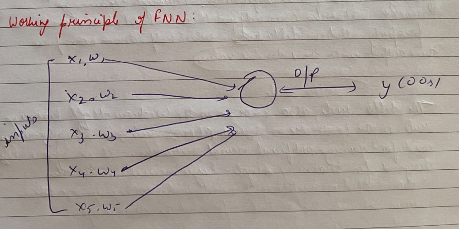

When the feed forward neural network gets simplified, it can appear as a single layer perceptron.

* This model multiplies inputs with weights as they enter the layer. Afterward, the weighted i/p values get added together to get the sum.

* As long as the sum of the valves rises above a certain
threshold, set a zero, the o/p values is usually 1,
while it falls below the threshold, it is usually -1.

* As a feed neural network model, the single-layer perceptron
often gets used for classification. Through training neural networks can 
adjust their weights based on a
property called the **delta rule**, which helps them compare
their outputs with the intended values.

### Delta rule:
- The delta rule, also known as the Widrow - Hoff learning
rule or the Least Mean Squares (LMS) rule, is an algorithm
used for training artificial neural networks. It is specially
designed for training single -layer neural networks
(also called perceptron) and aims to minimize the errors between
the actual o/p and the desired o/p.

- The delta rule calculates the error by comparing by comparing
the actual o/p of the perceptron to the desired o/p

                                e=d-y

                  
#### Layers of feed forward Neural Networks
1. Input Layer: The neurons of this layes receive input and pass it on
to the other layers of the network. Feature or attribute
numbers in the dataset must match the no. of neurons in the i/p layer.

2. Output Layer:
According to the type of model getting built, this layer
represents the forecasted feature.

3. Hidden Layer:
I/p and o/p layers get separated by hidden Layers.
Depending on the type of model, there may be several
hidden layers.

4. Neuron Weights:
Neurons get connected by a weight, which measures their
strength or magnitude. Similar to linear regression
coefficients, input weights can also get compared. Weight is normally
 b/w 0 and 1, with a value b/w 0 and 1.
.

5. Neurons: Artificial neurons get used in FNN, which later get
adapted from biological neurons. A neural network consists
of artificial neurons.
Neurons function in two ways:
- first, they create weighted input sums, and
second, they activate the sums to make them normal.

6. Activation functions!
Neurons are responsible for making decisions in this area.
According to the activation function, the neuron determine
whether to make a linear or nonlinear decision.
Three major categories:

i. **sigmoid** :
            
    input values b/w 0 and 11 get mapped to the off values.

ii. **tanh**:

    A value b/w -1 and 1 gets mapped to the input values.

iii. **ReLU (Rectified Linear Unit)**:

    Only the +ve values are allowed to flow through this function, -ve values get mapped to 0.

#### Advantages of FNN over other DeepLearning architectures
FNN or MLPs have several advantages, especially in
certain contexts, compared to other deep learning architectures.
1. Simplicity
- straightforward architecture 
- easier to understand and implement
- easier to train compared to complex architectures

2. Versatility

- General purpose model
-  No assumptions about input, unlike CNN or RNN that assume spatial structures or temporal dependencies respectively.
- Performs well on tabular data
- fewer parameters that avoids overfitting.

#### Limitations
- Not ideal for image data.
- Not suitable for sequential data.
- Scalability issues

Q. If FNN stands for Forward feed Neural network then why it uses backpropagation?

    The term "Feedforward Neural Network" refers to the architecture of the network and how data flows through it during the forward pass, not the training process.
    

#### Why the Names make sense?
- FNN: This name highlights the direction of data flow during inference or prediction. The network processes inputs and produces outputs in a forward manner without any cycles or feedback loops.

- Backpropagation: This refers to the method used to train
the network by propagating errors backward to adjust the weights,
the back propagation process is not part of the normal operation of the network when making predictions, it is specifically part of the training process.

## Convolutional Neural Network:
- CNN is a category of ML model, namely a type of deep
learning algorithm well suited for analyzing visual data.

    In 2012, a significant breakthrough occurred when researchers
    from the University of Toronto developed Alex Net, an AI model that significantly outperformed previous image recognition
    algorithms. AlexNet, created by Alex Krizhevsky, won
    2012 ImageNet Contest with 85% accuracy, for surpassing
    the runner-up's 74%. This success was driven by CNNs,
    a type of neural network that mimics human vision.

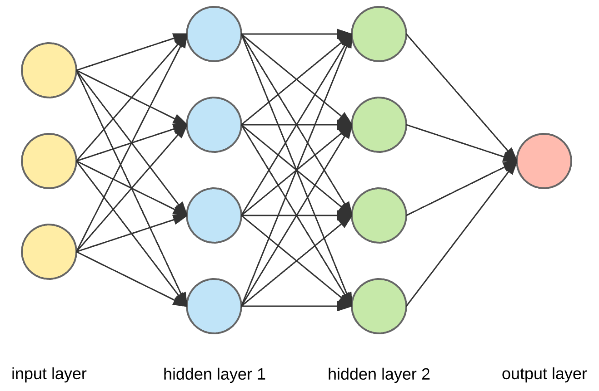

- CNN have become fundamental in CV tasks such as image classification, object detection and segmentation

#### What are convolutional Neural Network (CNN)?
- In DL, a Convolutional Neural Network (CNN/ ConvNet) is a class of deep neural networks, most commonly applied to analyze visual images.

- The CNN architecture uses a special technique called Convolution instead of relying solely on matrix multiplications like traditional neural networks.

- Convolutional networks uses a process called convolution, which combines two functions to show how one changes the shape of the other.

- The role of the convolutional networks is to reduce the
images into a form that is easier to process, without losing features
that are critical for getting a good prediction.

#### How does CNN work?
- What is RGB image?
An RGB image is nothing but a matrix of pixel values having
three planes whereas a grayscale image is the same but it has a single plane.

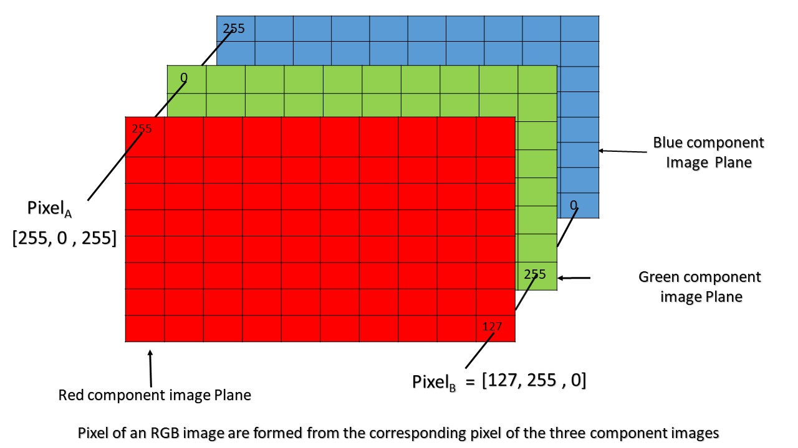

- Grayscale images

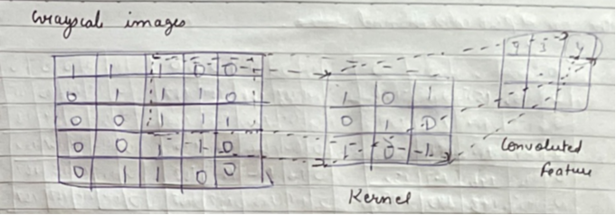

The above image shows what a convolution is. We take a filter/kernel (3x3) matrix and apply it to the input image to get the convolved feature. This convolved feature is passed on to the next layer.

- In the case of RGB color channel 

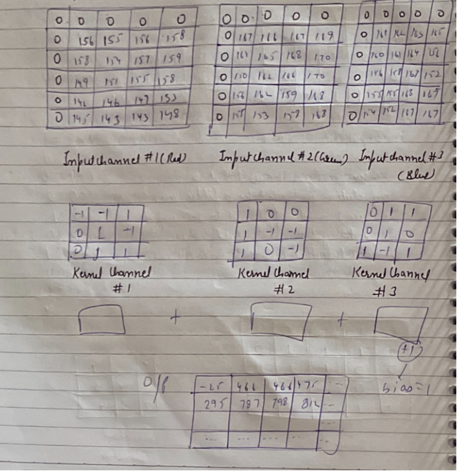

- The number of parameters in a CNN layer depends on the size of the receptive fields( filter kernels) and the number of filters.

- Each neuron in a CNN layer receives inputs from a local region of the previous layer, known as its receptive field. The receptive fields move over the input, calculating dot products and creating
a convolved feature map as the output.
- Usually, this map then goes through a ReLU activation
function. Classic CNN architectures like LeNet and more
modern ones like ResNet employ this fundamental principle

- CNN are composed of multiple layers of artificial neurons

#### Artificial Neurons in CNN
- Artificial neurons, a rough imitations of their biological
counterparts, are mathematical functions that calculate the
weighted sum of multiple inputs and outputs an activation
Value.
- When we input an image in ConvNet, each layer generates
several functions that are passed on to the next layer for
feature extraction.

#### Feature Extraction in CNN.
- The first layer usually extracts basic features such as
horizontal or diagonal edges. This o/p is passed
onto the next layer which detects more complex features
such as corners or combinational edges.
- As we move deeper into the network, it can identify
when more complex features such as objects, faces, etc.

- ConvNets are feed-forward network that process the imput
data in a single pass.
- Based on the activation map of the final convolution layer
,the classification layer outputs a set of confidence scores
(values b/w 0 and 1) that specify how likely the image is to
belong to a "class".

- Gradient descent is commonly used as the optimization
algorithm during training to adjust the weights of the
input layer and subsequent layers.

#### What is a pooling layer?
Similar to the Convolutional layer, the pooling layer is responsible
for reducing the spatial size of the convolved feature. This is
to decrease the computational power required to process the
data by reducing the dimensions.

There are two types of pooling:

                1. average pooling
                2. max pooling

1. Max pooling:
We find maximum value of a pixel from a portion of the image
covered by the kernel.
It also performs as a Noise suppresant, discards the noisy
activations altogether and also performs de-noising along to with
dimensionality reduction.

2. Average pooling:
-  returns the average of all the values from the portion of the
image covered by the Kernel.

**Note: Max Pooling performs a lot better than average pooling.**

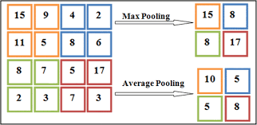

#### Architecture of CNN

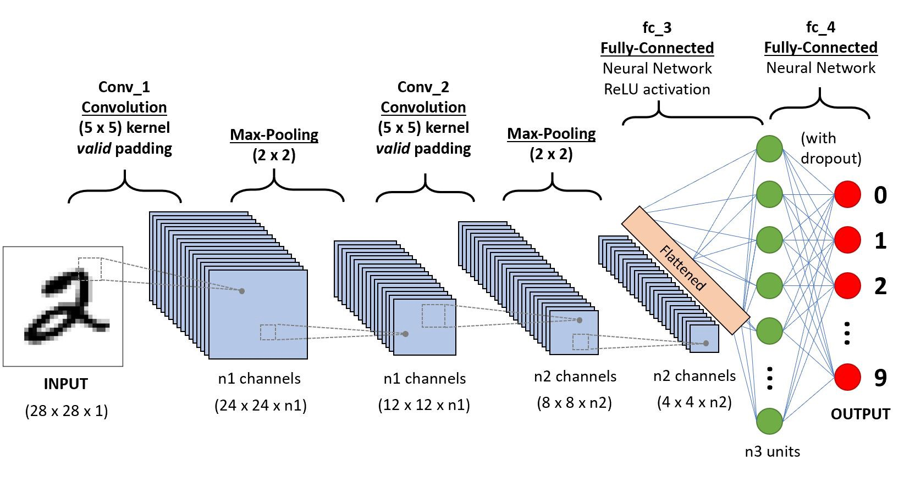

#### Components of CNN:
1. Convolutional Layer:
- It tries to learn the feature representation of the inputs,
whether it be the images of cats vs dogs or digits.
- For computing the different feature maps, it is composed of
several kernels/ matrix which are used.
- So, a filter / kernel of (nxn) matrix depends on the type of
problem we are solving, and then it is applied to the i/p
data (or image) to get the convolutional feature.
- This convolution feature is then passed on to the next layer
after adding bias and applying any suitable actuation function.

2. Pooling Layer:
- The pooling layer is placed b/w the convolutional layers.
- used for achieving shift invariance which is achieved by decreasing
the resolution of the feature maps.
- reducing the no. of connections b/w convolutional layers,lowers
the computational burden  on the processing units.

3. Fully Connected Layer:

Key components of CNN:

i. Convolutional Layer:

- filters / Kernel: Small matrices (eg, 3x3 or 5X5) that
slide over the input image, performing element wise multiplications
and summing up the results to produce a single value.
This process extracts features from the input data.
- Stride: The no. of pixel by which the filter moves across the i/p image.

**A stride of 1 means the filter moves 1 pixel at a time while stride of 2 means it moves 2 pixels at a time.** 

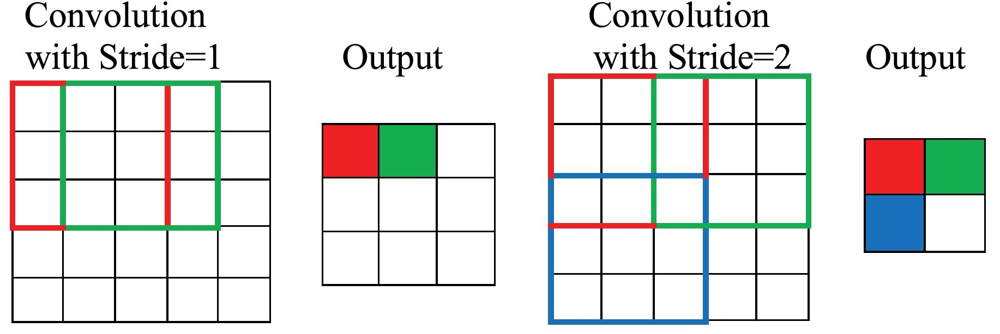

- Padding: Adding extra pixels around the border of the i/p
image to control the spatial dimensions of the o/p.

**"Valid" padding means no padding, while "same" padding means padding the input so that the o/p size matches the input size.**

ii.  Activation function

iii. Pooling Layer

iv. Fully Connected Layer:

- After several convolutional and pooling layers, the high-level
reasoning in the neural network is done via fully connected
layers.These layers are similar to those in traditional neural networks, where each neuron is connected to every neuron in the
previous layer.

- The output of the last convolutional or pooling layer is flattened
inte a 1D vector and fed into one or more fully connected layer.

v. o/p layer

### All CNN Architectures 
1. LeNet-5 (1998)
2. AlexNet (2012)
3. VGGNet (2014) 
4. GoogleNet (Inception) (2014)
5. ResNet (2015)
6. DenseNet (2014)
7. MobileNet (2017)
8. Shuffle Net (2017)
9. Squeeze Net (2018)
10. EfficientNet (2019)
11. Xception (2016)
12. NASNet (2018)
13. RegNet (2020)
14. ConvNexT (2022)

### Tranfer Learning
- The reuse of a pre-trained model on a new problem is known as
transfer learning in ML.
- A machine uses the knowledge learned from a prior assignment
to increase prediction about a new task in transfer learning.
- The knowledge of an already trained machine
learning model
is transferred to a different but closely linked problem throughout
transfer learning.
-  For example, if we trained a simple classifier to predict whether
an image contains a backpack, we could use the
model's training knowledge to identify other objects such as
sunglasses.
- Transfer learning involves using knowledge gained from one 
task to enhance understanding in another. It automatically
shifts weights from a network that performed task B to a
not work performing task A.
#### Steps in transfer learning
1. Choose a pre-trained model

- Select a model that has been pre-trained on large and divers
dataset (e.g. imageNet).
- Common pre-trained model include VGG, ResNet, Inception
and EfficientNet.

2. Remove the Output Layes:

- The final layer of the pre-trained model is typically
specific to the original task (e.g. classifying 1000 
ImageNet classes)
- Remove this layer the replace it with a new layer(s).
tailored to the new task.

3. Freeze the Pre-trained layers:

- Optionally, freeze the weights of the earlier layers to prevent
from being updated during training on the new task.
- Freezing layers helps retain the useful features learned from
the original dataset.

4. Add new Layers:
- Add new layers to the model that are specific to the new
task (e.g. a new fully connected layer with the appropriate no. of
output units for the new classification problem).
5. Train the new model:
- Train the new layers on the target dataset while keeping the
pre-trained layers frozen.
- Optionally, fine-tune some or all of the pre-trained layers with
a lower learning rate to adapt them to the new task.
6. fine-tuning:

**Meaning** :It refers to the process of taking a pre-trained
model and making small adjustments to its parameters
by continuing the training process on a new, often smaller dataset.

- Unfreeze some of the earlier layers and continue training
with a smaller learning rate to fine-tune the entire model.
- This step can help improve performance by allowing the
pre-trained features to adapt slightly to the new task.

#### Advantages:
- Reduced training time
- Less data required.
- faster convergence

- Improved performance
- High accuracy
- cost effective
- Overcoming limited data.
- Enhance data augmentation
- Leveraging state-of-art models.
- increment learning
- Cross-domain application.

#### Limitations

- Domain Mismatch.
- Overfitting
- Model Size: Pre-trained models are usually large, making
them computationally intensive and difficult to deploy
on resource-constrained device.
- Dependency on Pre-trained models.

### LeNet

- LeNet-5 is one of the earliest pre-trained models proposed by
Yann Le Cun and others in 1998. They used this architecture
for recognizing the hand written and machine-printed
characters.
- The main reason behind the popularity of this model was it's
simple and straightforward architecture.

- It is a multi-layer convolution neural network for image
classification.

#### Architecture of the model:
- The network has 5 layers with learnable parameters and hence
named Lenet-5.
- 3 sets of convolution layers with a combination of average
pooling.
- 2 fully connected layers.
- At last, a softmax classifier which classifies the images into respective class. 

- The input to this model is a 32x32 grayscale image hence
the no. of channels is 1.

- We then apply the first convolution operation with the filter size 5x5 and we 6 such filters. As a result, we get a feature map
of size (28x28x6). Here the number of channels is equal to
the no. of filters applied.
- After the first pooling operation, we apply the average pooling and the size of the feature map which is reduced by half.Note that the no. of channels in intact.
- Next, we have a convolution layer with 16 filters of size 5x5.
Again the feature map changed it is 10x10x16. The output size
is calculated in a similar manner. After this we again applied
an average pooling or subsampling layer, which again
reduce the size of the feature map by half i.e., 5x5x16.

- Then we have a final convolution layer of size 5x5 with 120
filters.
- Leaving the feature map size 1X1X120 After which flatten result is 120 values.
- After these convolution layers, we have a fully connected layer with
84 neurons. At last we have an o/p layer with 10 neurons since the data have 10 classes.
On next page, here is the final architecture of the Lenet -5 model.

#### LeNet Architecture
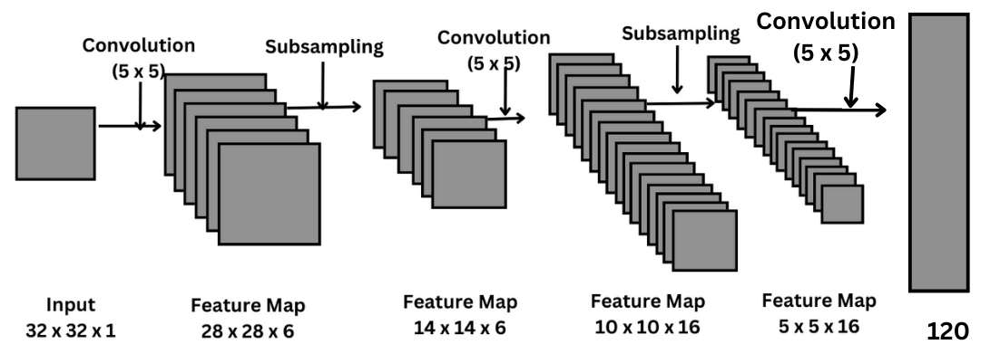

#### Advantages
- Simplicity, straight forward
- Computational efficiency
- effective for small datasets

#### Limitations
- Limited depth
- Small filter size
- Lack of modern techniques.
- Scalability issues
- performance.

#### Calculation for feature map is done by:

                    ((n+2p-f)/stride)+1
                    f=filter size
                    p=padding

## AlexNet Architecture

- AlexNet won the ImageNet large-scale visual recognition challenge
in 2012.
- The model was proposed in the research paper by Alex Krizhevsky
and his colleagues.
In this model the depth of the network was increased in comparison
to Lenet-5.
- Alexnet had eight layers with learnable parameters.
- model consists of five layers with a combination of max
pooling followed by 3 fully connected layers and they use
ReLU activation in each of these layers except the o/p layer.
- They found out that using the relu as an activation function
accelerated the speed of the training process by almost six times.
- Also used the dropout layers, that prevented their model
from overfitting.
- Dataset used Imagenet dataset

#### AlexNet architecture:
Since AlexNet is a deep architecture, the authors introduced
padding to prevent the size of the feature maps from reducing
drastically.
input to the model: 227x227x3

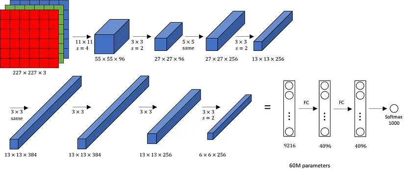

- If we look at the architecture till now, the no. of filters is
increasing as we are going deeper. Hence it is extracting more features as we move deeper into the architecture.

- Also the filter size is reducing, which means the initial
filter was large and as we go ahead the filter size
is decreasing resulting in a decrease in the feature map shape.

#### Advantages

- Depth and complexity
- ReLU activation function
- Dropout for Regularization (To combat overfitting)
- Data Augmentation can be employed
- Local Response Normalization (LRN): It used LRN to
normalize the output of each neuron across the feature map,
which helped in reducing overfitting and improved the
model's performance

- GPU utilization

#### Limitations
- High computational cost (large no. If parameters leads to memory cost)
- Limited depth (relatively shallow compared to modern architectures)
- Large filter size
- LRN : LRN is no longer commonly used in modern architecture
because it does not provide significant benefits and can be
Computationally expensive. Batch normalization is typically
preferred for its regularization and performance benefits.
- Lack of Modular Design
- Manual Hyperparameters

### VGG Net

- It is a typically deep convolutional Neural Network (CNN) design with
numerous layers.
-  stands for Visual Geometry Group.
- The term "deep" defines the no. of layers, with VGG-16 Or
VGG-19 having 16 or 19 convolutional layers respectively.
- Innovative objective identification models are built using the
VGG architecture.
#### VGG architecture.

VGGNet:

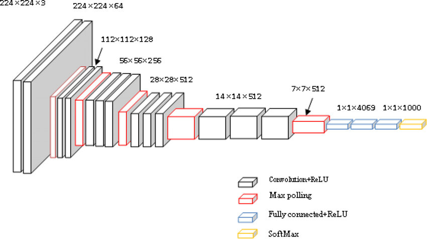

#### VGG16
- The convolutional neural network model called the VGG model, or
VGGNet, that supports 16 layers is also known as VGG16.
- It was
developed by A. Zisserman and K. Simonyan from
The University of Oxford.
- It significantly outperforms Alex Net by substituting
several 3x3 kernel-sized filters for the huge kernel-sized
filters.
- The VGGNet 16 has 16 layers and can classify photos into
100 diffrent object categories.
- The model also accepts images with a resolution of **224x224**

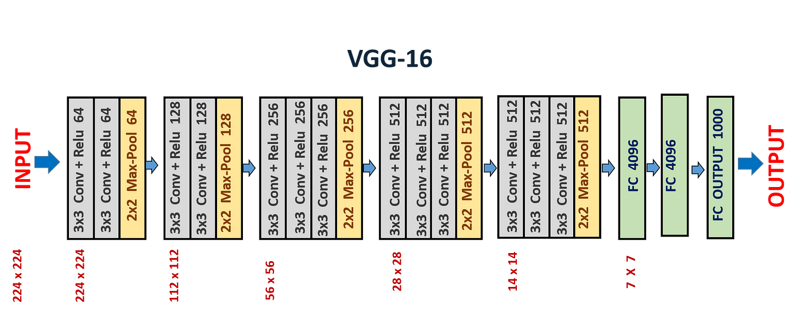

#### VGG19
- The VGG19 model (also known as VGGNet 19) has the
same basic idea as the VGG 16 model, with the exception
that it supports 19 layers.
- The number **16** and **19**, refer to the model's weight layers
(convolution layers).
- In comparison to VGG16, VGG 19 contains three extra
convolutional layers.

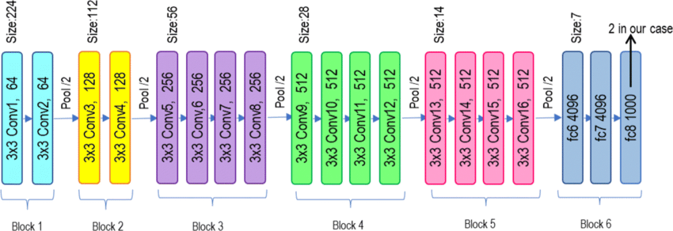

### Google Net
#### Inception Module
- The inception module is a building block for convolutional Neural
Networks (CNN) introduced by Google researchers in their
seminal paper "Going Deeper with convolutions" in 2014.
- This architecture, also known as GoogleNet
- The inception module is designed to allow a CNN to benefit from
multi-level feature extraction by implementing features of
various sizes in the same layer of the network.
- Key features:
1. Multi-level feature extraction
2. Dimensionality reduction
3. Pooling
.
#### Evolution

- The inception module has evolved through several iteration,
leading to improved versions such as Inception V2, Inception-V3
and Inuption-V4.
- These versions have introduced various optimizations,
including factorization of convolutions, expansion of the filter
bank outputs, and the use of residual connections.
- One notable variant is the Inception-ResNet hybrid, which
combines the inception architecture with residual connections
from ResNet.

#### Google Net
- Google Net, released in 2014, set a new benchmark in object
classification and detection through its innovative approach
(achieving a top-5 error rate of 6.1%, nearly half the
error rate of the previous year's winner. ZF Net with 11.7%).

- Google Net's deep learning model was deeper than all the previous
models released with 22 layers in total.
- Increasing the depth of the Machine Learning model is intuitive
as deeper models tend to have more learning capacity and
as a result this increases the performance of a model.
(Only possible if we solve vanishing gradient problem.)

- The inception module, the key innovation introduced by a
team of Google researchers solved this problem. Instead of
deciding what filter size to use and when to perform a max
pooling operation, they combined, multiple convolution
filters.

#### Detailed Inception Module Explanation
The inception module is a key innovation introduced in the
inception (GoogleNet) architecture. It allows the network to
efficiently captures and process input at multiple scales by
applying several different types of convolutional and pooling
operations in parallel.

##### Structure of an Inception Module:
An inception module typically consist of the following components-
1. 1x1 Convolution:
 - Reduces the no. of input channels (dimensionality reduction)
before applying more computationally expensive. Convolutions
(like  3x3 and 5x5). This helps to reduce computational
cost.

2. 3x3 Convolution:
- Captures medium-sized features from the input feature map.
Before applying a 3X3 convolution, a 1x1 convolution is often
used to reduce the number of input channels, which makes
the process more
efficient.

3. 5x5 Convolutions:
- Captures larger features from the input feature map. Similar to
3x3 convolution, a 1x1 convolution is applied beforehand to
reduce computational expense.

4. 3x3 MaxPooling:
- Helps in capturing spatial relationships and invariance. After max
pooling,a 1x1 convolution is applied to the pooled feature map to control the dimensionality.

5. Concatenation:
- The outputs of the above operations and are concatenated along
the depth (channel) dimension to form the final outputs
of the inception module. This results in a combination of
feature maps at different scales.

#### Architecture of Google Net

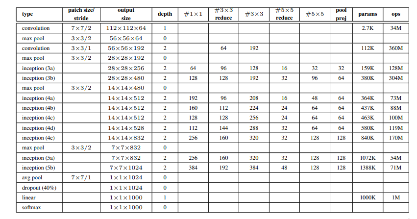

• GoogleNet model is particularly well-known for its use of inception
modules, which serve as its building blocks by using parallel convolutions with various filter sizes (1x1, 3x3, and 5x5) within a single layer.
- The outputs from these filters are concatenated.

- Moreover, the architecture is relatively deep with 22
layers, however
the model maintains computational efficiency despite the
increase in the no. of layer.
#### Key features of Google Net
- Inception Modul
- The 1X1 Convolution
- Global Average Pooling
- Auxiliary Classifiers for training
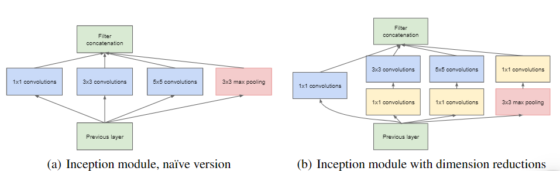

- Input featur Map Size: 28x28.
- Input Channels: 192
- No. of filtus in 3x3 Conv (F):96

#### Global Average Pooling
It is a CNN technique in the place of fully connected layers
at the end part of the network. This method reduces the total
no. of parameters and minimizes overfitting.
#### Auxiliary Classifiers for Training
- These are intermediate classifiers found on the side of the network.
- These are
only used during training and in the inference, these are
omitted.
- Auxiliary classifiers help overcome the challenges of training very
Deep Neural Networks, and vanishing gradients (when the gradients
turn into extremely small values).
- In Google Net architecture, there are two auxiliary classifiers in the
network. They are placed strategically, where the depth of the feature 
extracted is sufficient to make a meaningful impact, but before
the final prediction from the o/p classifier.

#### Structure of each auxiliary classifier.

- An average poding layer with 5x5 window and stride 3.
- A 1x1 convolution for dimension reduction with 128 filters
- Two fully connected layers,the first layer with 1024 unite,
followed by a dropout layer and the final layer corresponding
to the no. of classes in the task.
- A softmax layer to o/p the prediction probabilities.

- These auxiliary classifiers help the gradient to flow and not
diminish too quickly, as it propagates back through the 
deeper layer. This is what makes training a deep neural
network like Google Net possible.
- Moreover, the auxiliary classifiers also help with model
regularization. Since each classifiers contributes to the final
output, as a result, the network distributes its learning across
different parts of the network.
- This distribution prevents the network from relying too heavily
on specific features or layers, which reduces the chances of
overfitting.

#### Inception Family Variants
1. Google Net (Inception V1)
- introduction of inception modules, auxiliary classifiers,
global average pooling
- 2014

2. Inception V2
- Batch normalization, factorized convolutions (eg, 5x5.
replaced by two 3×3), improved training
speed
- 2015
3. Inception v3
- Further factorization (eg., (1x7 and 7x1), asymmetric
convolutions, label smoothing
- 2015
4. Inception v4
- Increased depth and complexity, advanced factorization
techniques.
5. Inception - ResNet V1,
- Combination of inception modules with residual connections
- Enhanced version of Inception ResNet V1 with further improvements

### Vanishing Gradient Problem:
The Vanishing Gradient Problem is a common issue in the training
of deep neural networks, particularly those with many
layers. It occurs when the gradients of the loss function with
respect to the network's parameters become very small
as they propagated backward through the network during training.
This makes it difficult for the network to learn and update
its parameters effectively.
#### Causes:
1. Activation functions like sigmoid and tanh can squash their input
into a very small range
2. Deep Networks: the multiplication of many small gradients
during backpropagation can lead to an exponentially small gradient.
3. Weight Initialization:
- Poor weight initialization can exacerbate the vanishing
gradient problem.
- If weights are initialized with very small values, the gradient
can quickly become too small to be useful.
#### Consequences:
1. Slow convergence: Training becomes very slow because
the updates to the network's parameters are very small.
2. Poor Performance: The network may fail to learn useful
features, especially in the early layers.

#### Solutions:
1. Activation functions and it's variants
2. Weight Initialization:

- He Initialization: For ReLU and it's variants, He
initialization (random initialization) from a distribution
with zero mean and variance scaled by the no. of input
units) helps maintain the gradient flow.

- Xavier Initialization: For sigmoid and tanh activation
functions, Xavier initialization helps by scaling the weights
according to the no. of input and output units.
3. Batch normalization
4. Residual Connections
- ResNet
- Highway Networks.

### ResNet Architecture
- ResNet stands for Residual Neural Network and is a type of
convolutional Neural Network (CNN).

- It was designed to tackle the issue of vanishing gradients in 
deep networks, which was a major hindrance in
developing deep neural networks.
- The ResNet architecture enables the network to learn multiple
layers of features without getting stuck in local minima, a common
issue with
deep networks

#### Features of ResNet:

- Residual connection
- Identity Mapping: ResNet uses identity mapping as the 
residual function, which makes the training process easier
by learning the residual mapping rather than the actual mapping.
- Depth: ResNet enables the creation of very deep neural networks,
which can improve performance on image recognition
tasks
- Fewer parameters: ResNet achieves better results with fewer
parameters, making it computationally more efficient
- State-of-the-art Results: ResNet has achieved state-of-
the art results on various image recognition tasks and
has become a widely
used benchmark for image recognition
tasks.

#### How ResNet works?

- Many residual blocks are stacked 
together to form a ResNet
- We have "shipped connections" which are the major part of
ResNet.
- The idea is to connect the input of a layes directly to the
output of a layer after skipping a few connections.

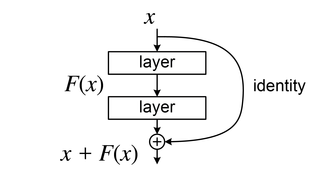

Here, x is the input to the layer which we are directly
using to connect to a layer after skipping identity connections
 and if we think the output
from identification connection to be f(x). Then we can
say that output will be f(x)+x.

- One problem that may happen is regarding the dimensions.
Sometimes the dimensions of x and F(x) may vary and this needs to be solved.

- Two approaches can be followed in such situations:
1. involves padding the input x with weights such as it
now brought equal to that of the value
coming out.

2. includes using a convolutional layer from x to addition
to f(x)

- The skip connections in ResNet solves the problem of
vanishing gradient in deep neural networks by allowing this
alternate shortest path for the gradient to flow through.

- The complete idea is to make F(x)=0. So that at the
end we have Y = X as result. This means that the

value, coming out from the activation function of the
identity blocks is the same as the input from which we 
skipped the connections.

### ResNet50
- ResNet50 is CNN architecture that belongs to the ResNet
(Residual Network) family, a series of models designed to address the challenges
associated with training deep neural networks.

- Developed by researchers at Microsoft

- ResNet architecture comes in various depths, such as ResNet-18,
ResNet -32, and so forth with ResNet50 being a mid-sized variant.
- It was released in 2015

#### ResNet and Residual Blocks
- The primary problem ResNet solved was the degradation problem
in deep neural networks. As networks become deeper, their accuracy
saturates and degrades rapidly.
• This degradation is not caused by overfitting, but rather the
difficulty of optimizing the training process.

- The deeper network has higher training error and thus test ersor
- ResNet solved this problem using Residual Blocks that allow for the
direct flow of information through the skip connections.

- The residual block used in ResNet 50 is called the Bottleneck

Residual Block.
- Breakdown of the architecture or the residual block.
1. ReLU Activation
2. Bottleneck convolution Layers:
The block consists of three convolutional layers with batch
normalization and ReLU activation after each :
- The first convolutional layer likely uses a filter size
of 1x1 and reduces the no. of channels in the input data.
The dimensionality reduction helps to compress the data and
improve computational efficiency without sacrificing too
much information.

- The second convolutional layer might use a filter size of 3x3
to extract spatial features from the data
The third convolutional layer again uses a filter size of 1x1 to
restore the original no of channel before the o/p is added to
the short cut connection.
3. skip Connection

#### Stacking the Blocks: Building ResNet-50.
.
- ResNet-50 incorporates 50 bottleneck residual blocks,
arranged in a stack manner. The early layers of
the network feature conventional convolutional and pooling
layers to preprocess the image before it undergoes further
processing by residual blocks.
- Ultimately, fully connected layers positioned at the pinnacle
of the structure utilize the refined data to categorize the image
with precision.

### DenseNet

- DenseNet is densely connected -convolutional networks.
It is very similar to a ResNet with some fundamental
differences. ResNet is using
an additive method that
means they take a previous output
as an input for a future layer, and in DenseNet takes all previous
output as input for a future layers
- DenseNet architecture was specially developed to improve
accuracy caused by vanishing gradient in high-level 
neural networks due to the
long distance b/w input
and o/p layers and the info. vanishes before reaching its destination.

- No. of connections in DenseNet=(L(L+1))/2
- In dense net, we have less no. of layers than the other.
model, so here we can train more than 100 layers of the model ver easily by using this technique.
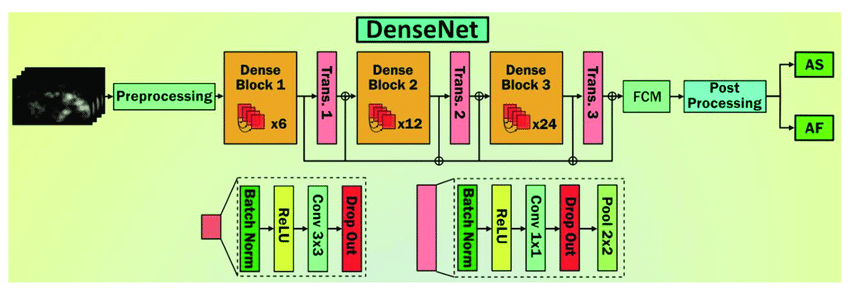

- As we go deeper into the network this becomes a kind
of unsustainable, if we go 2nd layer to 3rd layer so
3rd layer takes an input not only 2nd layer but it
takes input all previous layers.
- Let's say we have about 10 layers. Then the 10th layer will
take us to input all the feature maps from the preceding
nine layers. Now if each of these layers, let's produce
122 features. maps and there is a feature map explosion,
- to overcome this problem we create a dense block here and
so each dense block contains a prespecified no. of layers
inside them and the o/p from that particular dense block is given
to what is called a transition layer and this
layer is like 1x1 convolution followed by Max pooling
to reduce the size of the feature maps.
- So the transition layer allows for max pooling, which typically
leads to a reduction in the size of the feature maps.

#### Concepts in Dense Net

- Growth Rate: This determines the no. of feature maps o/p
into individual layers inside dense blocks.
- Dense Connectivity: By dense connectivity, we mean
that within a dense block each layer gets us imput
feature maps from the i/p feature maps.

- Composite functions: 
Sequence of operations : batch normalization,ReLU, 
Convolution Layer
- Transition layers

### Mobile Net V2 :

- A light weight CNN architecture, Mobile Net V2, is specifically
designed for mobile and embedded vision applications.
- The model's ability is to strike a good balance between
model size and accuracy, rendering it ideal for resource
- Constrained devices.

#### Why use Mobile Net V2 for Image Classification?

1. It's lightweight architecture allows for efficient deployment
on mobile and embedded devices with limited computational
resources.
2. It achieves competitive accuracy compared to larger and
more computationally expensive models.
3. model's smaller size enables faster inference times,
making it suitable for real-time applications.

#### Mobile Net V2 Architecture
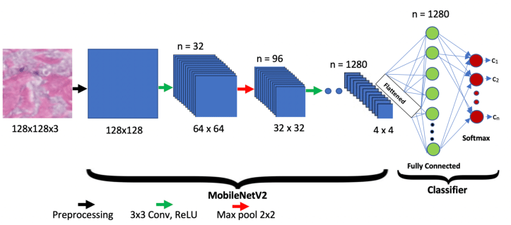

- Depth wise separable Convolution:

It is a technique used in MobileNet V₂ to reduce the
Computational cost of convolutions. It separates the standard
convolution into separate operations: depthwise convolution
and pointwise convolution.
-  Inverted Residuals:

It is a key component of MobileNet V2 that helps improve
the model's accuracy. They introduce bottleneck structure
that expands the no. of channels before applying depth wise
separable convolutions. This expansion allows the model to
capture more complex features and enhance its representation power.
- Bottle neck Design
It reduces the computational cost by using 1x1 convolutions
to reduce the no. if channels before applying depthwise
separable convolutions, helps maintain a good balance b/w
model size and accuracy-
- Linear Bottlenecks:
the
It is used to address the issue of info. loss during the
bottleneck process by using linear activations instead of
non-linear activations, the model preserves more information
and improves it's ability to capture fine-grained details.
- Squeeze-and-Excitation (SE) Block:
They are added to enhance its feature representation
capabilities. These block adaptively recalibrate the channel-
wise feature  responses, allowing the model to focus on more informative features and suppress less relevant ones.

### Efficient Net:
- The technique of randomly scaling model requires
manual tuning and many person hours, often resulting
in little or no noimprovement in performane
- The authors of Efficient Net proposed scaling up CNN models
to obtain better accuracy and efficiency
efficiency in a much more
moral way.

- Introduced in 2019, it became a go-to architecture for many
tasks, including object recognition, image segmentation
even language processing.
- Ability: Computational efficiency and model performance

-By systematically scaling the model's dimensions (width, depth and resolution) in a principled manner, Efficient Net achieves
unprecedented levels of efficiency without compromising accuracy

- It is build upon the concept called **compound scaling**
- The idea behind compound scaling is to scale three essential
dimensions of neural network: width, depth and resolution
1. Width:
- refers to the no. of channel in each layer of the neural
network
- ↑ width, model Can capture more complex patterns
and features, resulting in improved accuracy
- small width, leads to a more lightweight model, suitable for
low-resource environments.
2. Depths: 

- scaling pertains to the total no. of layers in the network.
- Deeper models can capture more intricate representations
of data, but they also demand more computational resources
- shallower models are computationally efficient but may sacrifice accuracy.
3. Resolution:
- Scaling involves adjusting the imput image's size.
- ↑ resolution images provide more detailed info.,
potentially leading to better performance. However, they
also require more memory and computational power.

- lower resolution images,consume fewer resources but may lead to a loss in fine-grained details.

#### How compound scaling works

- The process begins with a baseline model, which serves as

the starting point,This baseline model is usually a
reasonably sized network.

- Then a compound coefficient is introduced as a user-defined
parameter that dictates how much to scale the dimensions of
the neural network. It is a single scalar value that uniformly
scales the width, depth and resolution of the model.
By adjusting the phi value. The overall, complexity and resource
requirements of the model can be controlled.

- The scaling factors for each dimension are derived from
the compound coefficient phi.

        → Width scaling!: The width of the neural network is scaled proportionally by raising phi to the power of a specific exponent (typically denoted as α)

        → Depth scaling: Similarly, the depth of the network
        is scaled by raising phi to another exponent (denoted as beta)
        → Resolution scaling: The resolution or input image size
        is scaled by multiplying the original resolution by phi raised to a different exponent (usually denoted as gamma)
        

- Optimal exponents need to be determined.

    → The values of these exponents are typically derived
    through empirical grid search or optimization process.

    → Smaller phi: more lightweight and resouse-efficient
    models.

    → larger phi: more powerful but computationally intensive models.

#### Architecture
- uses Mobile invited Bottleneck (MB Conv) layers which
are a combination of depth-wise separable convolutions
and inverted residual blocks.
- uses SE

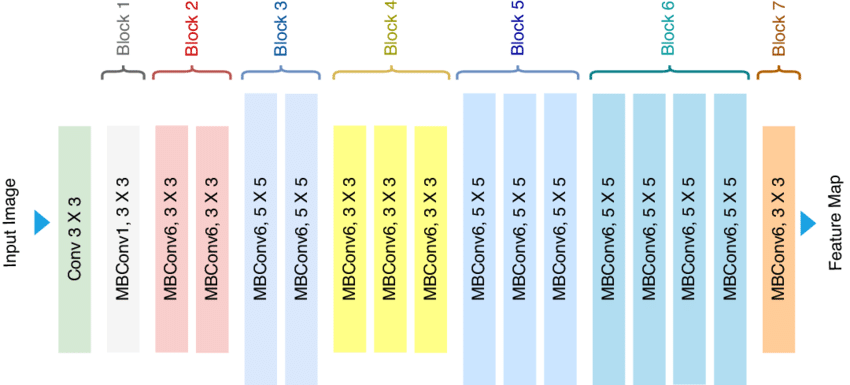
