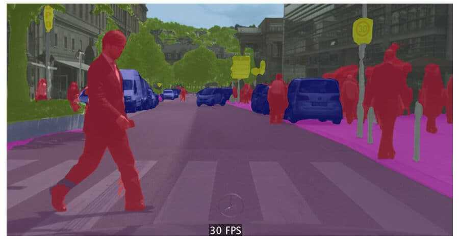
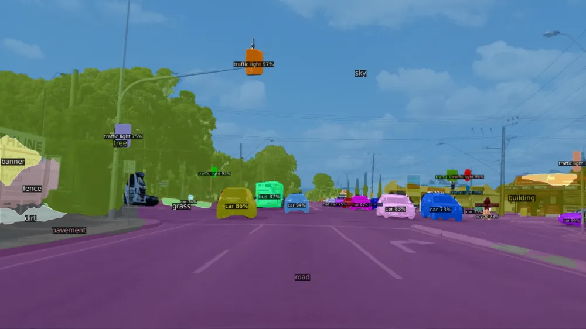
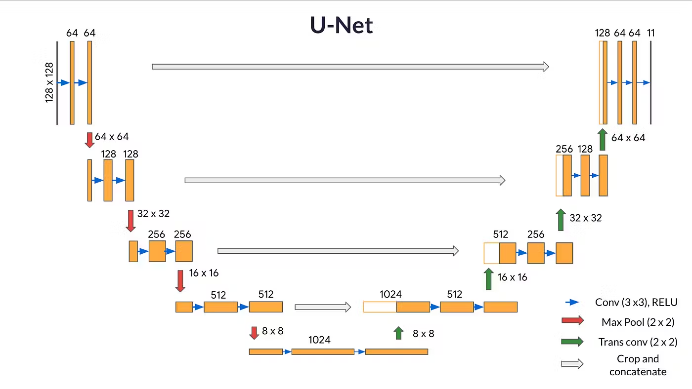
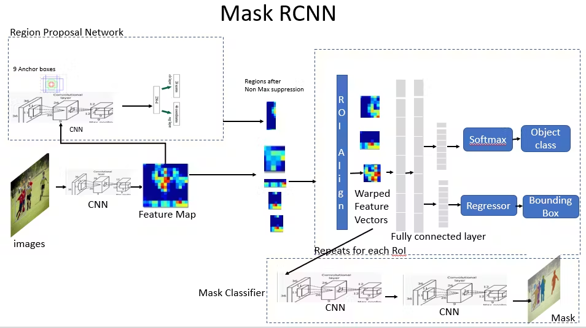

## What is segmentation in Computer Vision?
Segmentation in computer vision is the process of partitioning an image into different segments or regions, usually to simplify or change  the representation of an image into something more meaningful and easier to analyze. Each segment corresponds to a part of the image that shares certain visual characteristics.

### Types of segmentation:
1. **Semantic Segmentation**:
- **Definition**: Assigns a class label to each pixel in the image, where pixels with the same label belong to the same category.
- **Use Case**: Understanding the overall scene by categorizing regions like roads, buildings, cars, etc.
- **Example**: In a street scene, all pixels corresponding to "car" are labeled the same, regardless of the specific car.

#### How Does Semantic Segmentation Work?
Semantic segmentation aims to extract features before using them to form distinct categories in an image. The steps involved are as follows:

- Analyze training data for classifying a specific object in the image.
- Create a semantic segmentation network to localize the objects and draw a bounding box around them.
- Train the semantic segmentation network to group the pixels in a localized image by creating a segmentation mask.

2. **Instance Segmentation**:
- **Definition**: Similar to semantic segmentation but distinguishes between different instances of the same object category.
- **Use Case**: Detecting and segmenting individual objects like separating different cars in a traffic scene.
- **Example**: Labeling each car separately in an image, assigning different labels to each instance.

#### How Does Instance Segmentation Work?
Instance segmentation involves identifying boundaries of the objects at the detailed pixel level, making it a complex task to perform. But as we saw earlier, instance segmentation contains 2 significant parts:

1. Object Detection: Firstly, it runs object detection to find all bounding boxes for every object in an image
2. Semantic Segmentation: After finding all the rectangles (bounding boxes), it uses a semantic segmentation model inside every rectangle

### Segmentation Models: U-NET and Mask R-CNN
1. U-Net Architecture:
- Originally designed for medical image segmentation, the U-Net architecture has become synonymous with success in various image segmentation tasks. 
-It's architecture is unique because it has a symmetric expanding pathway that lets it get accurate location and context information from the contracting pathway. 
- This structure allows U-Net to deliver high accuracy, even with fewer training samples,making it a preferred choice for biomedical image segmentation. U-Net, renowned for its efficacy in biomedical image segmentation, stands out due to its sophisticated architecture, which has been instrumental in advancing medical image computing and computer-assisted intervention.
-  Developed by Olaf Ronneberger, Philipp Fischer, and Thomas Brox.

** Core Components of U-Net Architecture**
- Contracting Path: It follows the typical convolutional network architecture. It consists of repeated application of two 3x3 convolutions, each followed by a ReLU and a 2x2 max pooling operation with stride 2 for downsampling. With each downsampling step, the number of feature channels is doubled.

- Bottleneck: After the contracting path, the network transitions to a bottleneck, where the process is slighlty different. Here the network applies two 3x3 convolutions, each followed by a ReLU. However, it skips the max-pooling step. This area processes the most abstract representations of the input data.

- Expanding Path: It performs an up-convolution and concatenates with the high-resolution features from the contracting path through skip connections. This step is crucial as it allows the network to use information from the image to localize precisely. Similar to the contracting path. this section applies two 3x3 convolutions, each followed by ReLU after each up-convolution.

- Final Layer: The final layer of the network is a 1x1 convolution used to map each 64-component feature vector to the desired number of classes.

2. Mask R-CNN Architecture
- An extension of the Fast R-CNN, Mask R-CNN, has set new standards for instance segmentation. 
- It builds on its predecessor by adding a branch of predicting segmentation masks on detected objects, operating in parallel with the existing branch for bounding box recognition. This dual functionality allows Mask R-CNN to detect objects and precisely segregate them within the image, making it invaluable for tasks requiring detailed object understanding. 
- The Mask R-CNN framework has revolutionalized the field of computer vision, offering improved accuracy and efficiency in tasks like instance segmentation. 
- It builds on the successes of previous models like Faster R-CNN, by adding a parallel branch for predicting segmentation masks.

**Core Components of Mask R-CNN**
- Backbone: It is the initial feature extraction stage. In Mask R-CNN, this is typically a deep ResNet Architecture. The backbone is responsible for processing the input image and generating a rich feature map representing the underlying visual content.

- Region Proposal Network(RPN): The RPN generates potential object regions(proposals) within the feature map. It does this efficiently by scanning the feature map with a set of reference boxes (anchors) and using a lightweight neural network to score each anchor's likelihood of containing an object.

- ROI Align: One of the key innovations in Mask R-CNN is the ROI align Layer, which fixes the misalignment issue caused by the ROI Pooling process used in previous models. It does this by preserving the exact spatial locations of the features, leading to more accurate mask predictions.

- Classification and Bounding Box Regression: Similar to its predecessors, Mask R-CNN uses the features within each proposed region to classify the object and refine its bounding box. It uses a fully connected network to output a class label and bounding box coordinates.

- Mask Prediction: This sets Mask R-CNN apart. In addition to the classification and bounding box outputs, there's a parallel branch for mask prediction. This branch is a small Fully Convolution Network(FCN) that outputs a binary mask for each ROI.