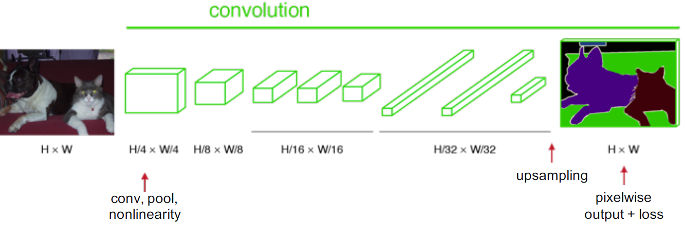
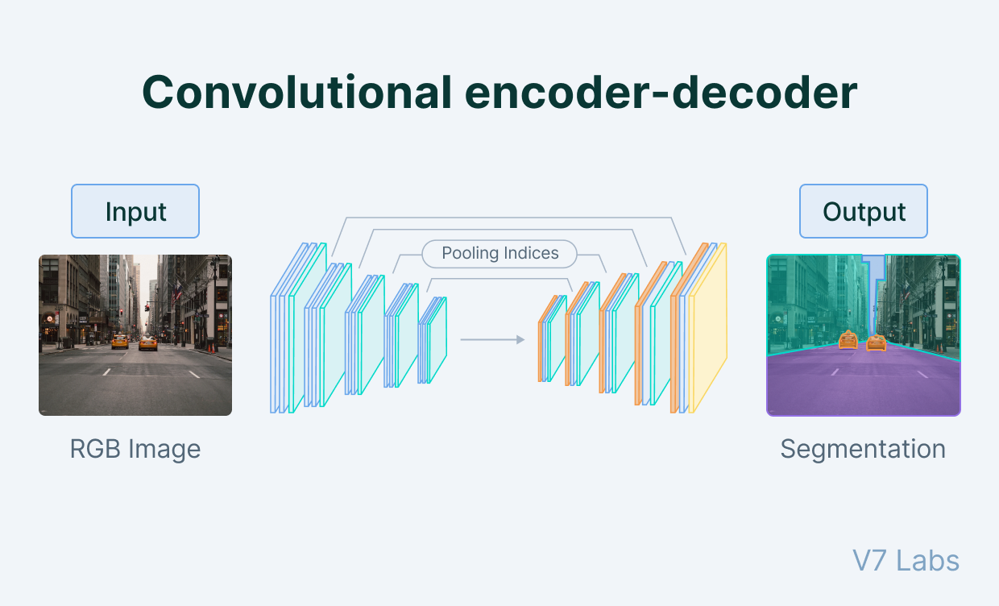
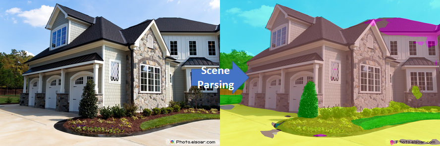
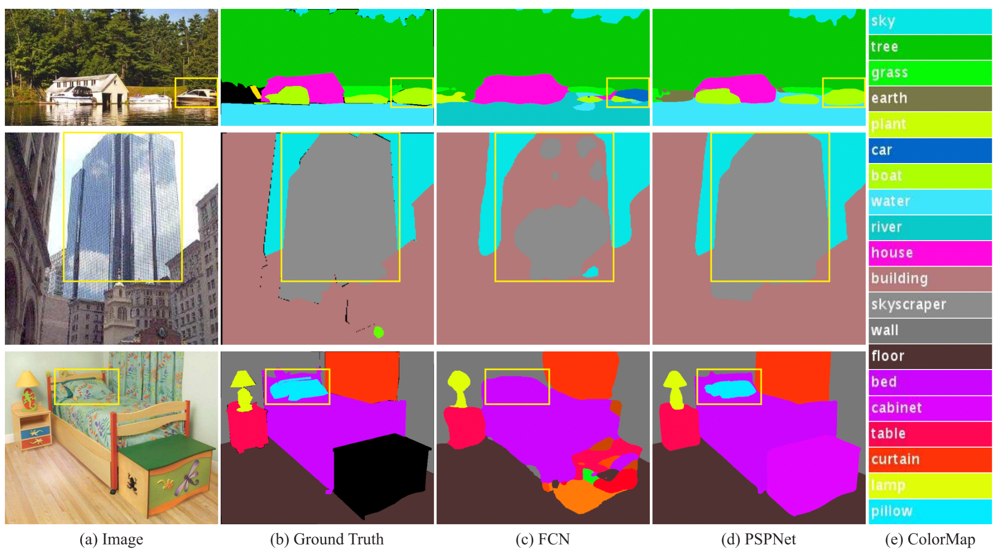
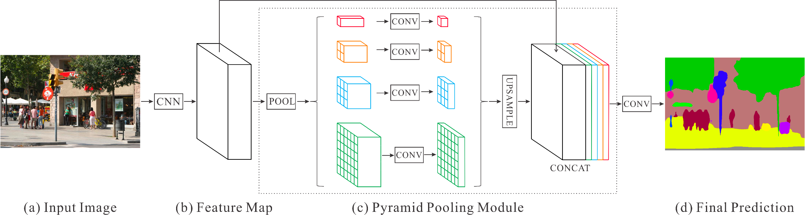
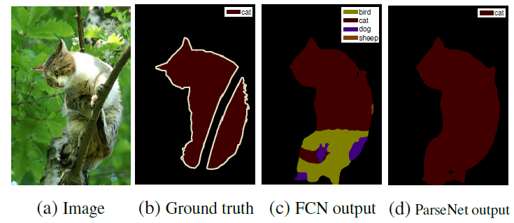
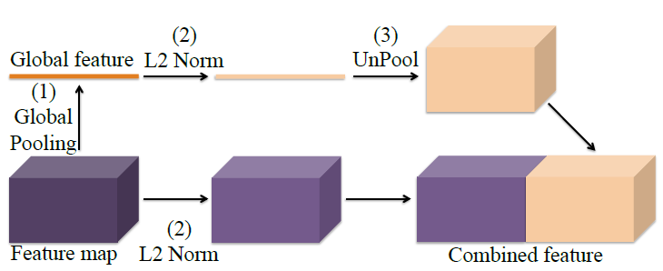
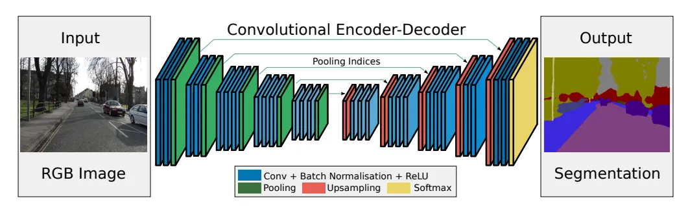

### What is semantic segmentation

- Semantic Segmentation assigns a label to the objects in an image and determines which pixels each object takes up. In simple terms, it determines what's in a picture and where it is. 
- For example, computer vision semantic segmentation has found uses in self driving cars. These algorithms take pictures of the road and identify the locations of other cars, road signs, trees and other features.
- Semantic Segmentation considers multiple objects of the same class together. However, semantic segmentation is only one of three approaches to image segmentation, the task of partitioning an image into regions that share similar characteristics. 

### Working of Semantic Segmentation Labeling 
We can consider semantic segmentation as separating an individual item from the rest of an image. In a nutshell, the technique:
- Classifies a type of object found in an image
- Localizes it by finding the boundaries and drawing around it
- Segments it by grouping together the pixels into a localized image.

**Note**: Semantic Segmentation works with class labels and builds these outlines for each class of object it finds in the picture.

### Role of CNN in semantic segmentation
In order to extract objects, CNNs essentially have to compress the image during pooling layers and consequently lose some information in the process. This process is the convolutional encoder-decoder. 
- An encoder is a convolutional network that downsamples the image to pick up its features.
- A decoder, another convolution network, upsamples the image through an interpolation technique to divide the image into separate segments.

### Measuring Semantic Segmentation Accuracy through metrics
1. Pixel Accuracy: It is the most straightforward approach that calculates the number of correctly labeled pixels in relation to the total number of pixels. However, it doesn't always paint a full picture, especially if the image is taken up almost entirely by a single object.

2. Intersection Over Union(IOU): It compares the actual object in an image with the model's predicted outline of it. IOU takes the overlap between those two outlines and divides it by the union. IOU also works for multiple object classes by taking a weighted average for each class. If one object takes up a majority of the image, it will have less weight in the IOU calculation to prevent it from skewing the results.

3. F1 score: This one likewise aims to measure model performance accurately despite class imbalances. F1 combines two concepts: precision and recall.

     - Precision is how often a model is correct when it claims it found an object class. While it might not find all instances of that object, it has high confidence for the ones it does find.
     - Recall is a measure of how comprehensive the model is at finding all instances of an object class. High recall may result in several false positives, but the model doesn't miss any genuine positives.

### Various types of architectures for semantic segmentation
1. Fully Convolution Network:
- When it comes to semantic segmentation, we usually don’t require a fully connected layer at the end because our goal isn’t to predict the class label of the image.
- In semantic segmentation, our aim is to extract features before using them to separate the image into multiple segments.
- However, the issue with convolutional networks is that the size of the image is reduced as it passes through the network because of the max-pooling layers.
- To efficiently separate the image into multiple segments, we need to upsample it using an interpolation technique, which is achieved using deconvolutional layers.

Below image is the representation of CNN with upsampling and deconvolutional layer:
    

the convolutional network that is used to extract features is called an encoder. The encoder also downsamples the image, while the convolutional network that is used for upsampling is called a decoder.

Below image is the representation of convolutional encoder-decoder.
    

- The output yielded by the decoder is rough, because of the information lost at the final convolution layer i.e., the 1 X 1 convolutional network. This makes it very difficult for the network to do upsampling by using this little information.
- To address this upsampling issue, the researchers proposed two architectures: FCN-16 and FCN-8.
In FCN-16, information from the previous pooling layer is used along with the final feature map to generate segmentation maps. FCN-8 tries to make it even better by including information from one more previous pooling layer.

**When to use:**
- reasonably sized dataset that is well-annotated
- simpler segmentation tasks where fine details are not critical.
- leverage pre-trained models for quick deployment.

**Advantages:**

- Flexible and can adapt to various tasks.
- Easy to implement using existing CNN architectures.

**Disadvantage;**
- May struggle with detailed boundaries and fine features.

2. U-Net:
- modification of FCN.
- similar design of an encoder and a decoder.
- The former is used to extract features by downsampling, while the latter is used for upsampling the extracted features using the deconvolutional layers. 

**Difference**:  FCN uses the final extracted features to upsample, while U-net uses something called a shortcut connection to do that.

U-Net Architecture:
    

- short-cut connection in the U-Net is designed to tackle the information loss problem.
- The U-net is designed in such a manner that there are blocks of encoder and decoder. These blocks of encoder send their extracted features to its corresponding blocks of decoder, forming a U-net design.

**Note**: As we know, as image travels through the convolution networks and its size is reduced. This is because it simultaneously max-pool layers, which means that information is lost in the process. This architecture enables the network to capture finer information and retain more information by concatenating high-level features with low-level ones.

This process of concatenating the information from various blocks enables U-net to yield finer and more accurate results.

**When to Choose:**
- for biomedical image segmentation tasks like tumor or organ delineation.
- working with smaller datasets, as it can generalize well with data augmentation.
- applications requiring high localization accuracy due to its skip connections.

**Advantages**
-Retains fine details through skip connections.
- Effective for small datasets with strong augmentation.

**Limitation:**
- Memory-intensive, which can be a concern with large images.

3. Pyramid Scene Parsing Network(PSPNet):
- designed to get a complete understanding of the scene.

Scene Parsing:
    

Comparison of FCN and PSPNet:
    

- PSPNet exploits the global context information of the scene by using a pyramid pooling module.

PSPnet with Pyramid Pooling Module:
    

- From the above diagram we can see that there are 4 convolutional components in pyramid pooling module.
    - The first component indicated in red yields a single bin output, while the other three separate the feature map into different sub-regions and form pooled representations for different locations.
    - These outputs are upsampled independently to the same size and then concatenated to form the final feature representation.
    - Because the filter size of the convolution network is varied (i.e., 1X1, 2X2, 3X3, and 6X6), the network can extract both local and global context information.
    - The concatenated upsampled result from the pyramid module is then passed through the CNN network to get a final prediction map.

**When to Choose:**

- segmenting in environments with multiple scales and complexities, such as urban scenes.
- understanding the overall context of the image is critical for your application.

**Advantages:**
- Captures multi-scale context effectively.
- Achieves high accuracy on various benchmarks.

**Limitation:**
Higher computational cost and longer training times.

4. DeepLab:
- Google developed DeepLab, which also uses CNN as its primary architecture.

**Difference:** Unlike U-net, which uses features from every convolutional block and then concatenates them with their corresponding deconvolutional block, DeepLab uses features yielded by the last convolutional block before upsampling it, similarly to CFN.
- The Deeplab applies atrous convolution for upsampling.
**Atrous Convolution**:
Atrous convolution (or Dilated convolution) is a type of convolution with defined gaps.
If k=1, the convolution will be normal. But if we increase the value of k by one—for example, k=2—then we skip one pixel per input.
Dilation rate defines the spacing between the values in a convolution filter.

The advantage of using an Atrous or Dilated convolution is that the computation cost is reduced while capturing more information.

**DeepLab V1**
Now we know that DeepLab’s core idea was to introduce Atrous convolution to achieve denser representation where it uses a modified version of FCN for the task of Semantic Segmentation.

This idea introduced DeepLab V1 that solves two problems.

1. Feature resolution
- The issue with DCNN is multiple pooling and down-sampling, which causes a significant reduction in spatial resolution.
- To achieve a higher sampling rate, the down-sampling operator was removed from the last few max-pooling layers, and instead, up-sample the filters (atrous) in subsequent convolutional layers were added.

2. Localization accuracy due to DCNN invariance
- In order to capture fine details, a fully connected Conditional Random Field (CRF) is introduced, which smoothens and maximizes label agreement between similar pixels.
- The CRF also enables the mode to create global contextual relationships between object classes.

**DeepLab V2**
- DeepLab V1 was further improved to represent the object in multiple scales.
- In PSPNet a pyramid pooling module is used to achieve multiple Semantic Segmentation with greater accuracy. Building on that theory, DeepLab V2 used Atrous Spatial Pyramid Pooling (ASPP).
- The idea was to apply multiple atrous convolutions with different sampling rates and concatenate them together to get greater accuracy.

**DeepLab V3**
- The aim of DeepLab V3 was to capture sharper object boundaries.
- This was achieved by adopting the encoder-decoder architecture with atrous convolution.
- Here are the advantages of using encoder-decoder architecture:
    - It can capture sharp object boundaries.
    - It can capture high semantic information because the encoders gradually reduce the input image while extracting vital spatial information; similarly, decoders gradually recover spatial information.

**When to Choose:**
- tasks involving diverse natural scenes where boundaries matter, such as landscape or street scene segmentation.
- require the model to understand varying object scales within the same image.

**Advantages:**
- Excellent at delineating object boundaries due to CRF refinement.
- Effective multi-scale feature extraction using atrous convolutions.

**Limitation:**
- More complex to implement and tune, requiring more computational resources.

5. ParseNet:
- FCN cannot represent global context information. Contextual representation of the data or image is known to be very useful for improving performance segmentation tasks. Because FCN lacks contextual representation, they are not able to classify the image accurately.

Comparison between FCN and ParseNet Output
    

- To acquire global context information or vector, the feature map was introduced that was pooled over the input image, i.e., global average pooling. Once acquired, the the global context vector was then appended to each of the features of the subsequent layers of the network.

**Note:** The quality of Semantic Segmentation is greatly improved by adding the global feature to local feature map.

ParseNet contexture model:
    

- As we can see, once the global context information is extracted from the feature map using global average pooling, L2 normalization is performed on them.
- Similarly, L2 normalization is also performed directly on the feature map.

- To combine the contextual features to the feature map, one needs to perform the unpooling operation. It ensures that both features are of the same size.

**When to Choose:**
- tasks where relationships and context between segments are crucial, such as in fine-grained object recognition.
- need flexibility in choosing the backbone network for feature extraction.

**Strengths:**
- Strong contextual understanding of segments.
- Flexible with various backbones.

**Limitation:**
- Computationally intensive, similar to other advanced architectures.

6. SegNet 
- designed to be an efficient architecture for pixel-wise semantic segmentation. 
- It is primarily motivated by road scene understanding applications which require the ability to model appearance (road, building), shape (cars,pedestrians) and understand the spatial-relationship (context) between different classes such as road and side-walk. In typical road scenes, the majority of the pixels belong to large classes such as road, building and hence the network must produce smooth segmentation.

Architecture of SegNet
    

- SegNet has an encoder network and a corresponding decoder network, followed by a final pixelwise classification layer. The encoder network consists of 13 convolutional layers which correspond to the first 13 convolutional layers in the VGG16 network designed for object classification.  
- They discard the fully connected layers in favor of retaining higher resolution feature maps at the deepest encoder output.
- Each encoder layer has a corresponding decoder layer and hence the decoder network has 13 layers.
- The final decoder output is fed to a multi-class soft-max classifier to produce class probabilities for each pixel independently.

**When to Choose:**
- working under tight memory and computational constraints, as it uses pooling indices for efficient memory use.
- simpler applications where segmentation tasks do not require capturing complex details.

**Advantages:**
- Efficient memory usage with straightforward implementation.
- Robust for many basic segmentation tasks.

**Limitation:**
- Limited capability to capture global context and finer details.

### Life Cycle of Semantic Segmentation
1. **Problem Formulation and Dataset Preparation**
- Objective Definition: First, define the problem you want to solve. For example, in autonomous driving, semantic segmentation is used to understand road environments, identifying lanes, vehicles, pedestrians, etc.
- Dataset Collection: The dataset for semantic segmentation consists of images paired with pixel-wise labeled masks. These masks represent the ground truth where each pixel is annotated with a class label. Popular datasets include:

    - COCO (Common Objects in Context)
    - PASCAL VOC
    - Cityscapes (for urban environments)
- Data Preprocessing: This involves resizing images, normalizing pixel values, augmenting data with rotations, translations, flips, and other transformations to improve model generalization.

2. **Model Design and Architecture**
3. **Training**
- Loss Function: The loss function for semantic segmentation is typically a pixel-wise loss, such as:

    - Cross-Entropy Loss: The most common loss function, which compares each pixel's predicted class with the ground truth.
    - Dice Coefficient: Used in cases with class imbalance, such as medical imaging, it measures overlap between the predicted segmentation and ground truth.
    - Intersection over Union(IoU): Measures the quality of predictions by comparing the intersection and union of predicted and ground truth segmentation.

- Optimization: The optimization process is done using gradient descent-based methods like Adam or SGD. During this phase, the model learns to associate image features with corresponding pixel-level classes.

Challenges during training:
- Class Imbalance: Often, some classes (e.g., background) dominate the image. Techniques like weighted loss functions or focal loss help mitigate this issue.
- Memory Consumption: Large images and high-resolution predictions demand a lot of memory. Strategies like cropping or patch-based training are often employed to fit the model into memory constraints.

4. **Evaluation**
Evaluation of a semantic segmentation model is done using metrics that assess pixel-level classification accuracy:

- Pixel Accuracy: The percentage of correctly classified pixels.

- Mean Intersection over Union (mIoU): Measures the overlap between predicted and true segmentation, averaged over all classes.

- Precision and Recall: For each class, precision and recall are calculated to understand how well the model is performing at detecting each specific class.

5. **Post Processing**
After the initial predictions, various post-processing techniques are applied to improve the quality of the segmentation:

- Conditional Random Fields (CRFs): CRFs are often used to refine the boundaries of segmented objects by modeling the spatial relationships between pixels.
- Morphological Operations: Techniques like dilation, erosion, and smoothing may be applied to improve boundary smoothness and remove noise.

6. **Model Deployment**
7. **Monitoring and Refinement**

