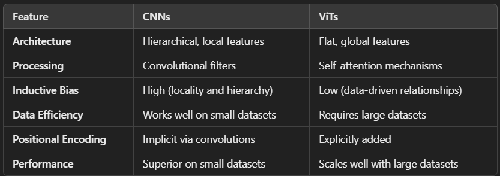
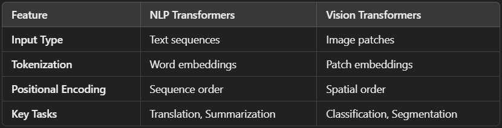

## Transformers
---

Transformers are deep learning architectures designed to process sequential data. Initially introduced in the context of NLP in the seminal 2017 paper **Attention is All You Need**, transformers rely on self-attention mechanisms to model relationships between elements in a sequence, regardless of their position. 

### Key Features of Transformers:
- **Self-Attention Mechanism:** Captures dependencies across the entire sequence, enabling the model to focus on relevant parts of the input.
- **Positional Encoding:** Adds Positional information to the input, as transformers are not inherently aware of the orders of elements.
- **Feedforward Layers:** Applied after the attention mechanism for non-linearity.
- **Scalability:** Can handle large datasets with parallelized training using GPUS.

## Vision Transformers(ViTs)
---
ViT or Vision Transformer, applies transformer architecture to computer vision tasks like image classification, segmentation and object detection. It was introduced in 2020
In contrast to CNNs, which rely on convolutions to process spatial information hierarchically, ViTs split images into patches and treat them as a sequence, similar to words in NLP tasks.

### Vision Transformers Architecture
**Key Components of ViT:**
1. Patch Embedding:
    - The input image is divided into fixed-size patches(e.g., 16x16 pixels)
    - Each patch is flattened into a vector, and a learnable linear projection(dense layer) is applied to create patch embeddings.

2. Positional Embedding:
    - Since transformers are unaware of spatial relationships, positional embeddings are added to patch embeddings to encode spatial information.

3. Transformer Encoder:
    - A stack of transformer blocks, each consisting of:
        - Multi-Head Self-Attention(MHSA): Helps the model focus on different parts of the image.
        - Feed Forward Neural Network(FFN): Adds non-linearity
        - Layer Normalization(LN) and residual connections for stable training.

4. Classification Token:
    - A special learnable token([CLS]) is prepended to the sequence of patch embeddings. The final representation of this token is used for classification tasks.

5. MLP Head:
    - A Multi-Layer Perceptron(MLP) head is applied to the [CLS] token for output tasks like classification.

**ViT Architecture Pipeline:**
1. *Input:* Image of size H x W x C (Height x Width x Channels).
2. *Patch Splitting:* Image is split into N=H/P x W/P patches of size PxP.
3. *Patch Embeddings:* Each patch is flattened into a vector and linearly projected to a fixed dimension D.
4. *Positional Embeddings:* Added to the patch embeddings to retain spatial information.
5. *Transformer Encoder:* Processes the sentence of patch embeddings using self-attention and feedforward layers.
6. *Output:* The[CLs] token is passed through an MLP head for classification.

**Variants of Vision Transformer Architectures**
1. ViT(Vanilla)
2. DeiT(Data-efficient ViT)
3. Swin Transformer
4. PiT(Pyramid Vision Transformer)
5. CvT(Convolutional Vision Transformer)
6. T2T-ViT (Tokens-to-Token Vision Transformer)
7. Twins(Twins-SVT)
8. CrossViT
9. Pooling-based Vision Transformer(PiT)
10. Segmenter
11. BEiT(BERT Pretrained Image Transformer)
12. ViTDet
13. MaxViT(Maximizing ViT)
14. DINO(Self-Supervised ViTs)
15. Hybrid Vision Transformers
16. MobileViT
17. ResT (Residual Transformer)
18. EfficientViT
19. MixFormer
20. Vision Longformer

**Benefits of Vision Transformers**
- ViTs process all patches simultaneously, capturing long-range dependencies better than CNNs.
- ViTs can scale with data size and pretraining, handling diverse vision tasks.
- Unlike CNNs, which require handcrafted convolutional kernels, ViTs use a unified architecture for multiple tasks.

**Comparison CNNS vs ViTs**

**Applications of ViTs**
1. Image Classification:
Object recognition tasks (e.g., ImageNet classification).
Models: ViT, DeiT, MobileViT.

2. Object Detection:
Identifying and localizing objects in images.
Models: DETR, Swin Transformer, ViTDet, Twins.

3. Image Segmentation:
Partitioning images into meaningful regions.
Models: MaskFormer,Segmenter, Swin Transformer, DINO.

4. Anomaly Detection:
Identifying irregularities in medical imaging or manufacturing.

5. Video Understanding:
Action recognition and video segmentation using Spatio-temporal ViTs.

6. Generative Models:
Used in image generation tasks (e.g., DALL-E).

7. Reinforcement Learning:
Applied in vision-based decision-making tasks. 

**Challenges**
1. Requires large datasets for effective training.
2. Self-attention has quadratic complexity with respect to sequence length, leading to higher memory and computation needs.
3. Less interpretable compared to CNNs due to lack of explicit spatial hierarchies.

**ViTs vs Transformers in NLP**

**Questions**
1."How can we make ViTs more data-efficient?"
- Solutions: Use smaller architectures (DeiT) or pretrain on larger datasets.

2. "How do we reduce the computational cost of ViTs?"
- Solutions: Use hierarchical structures (Swin Transformer) or hybrid models (CvT).

3. "Can ViTs generalize better than CNNs?"
- Yes, with enough data and compute power, ViTs often outperform CNNs on large datasets.

4. "How can ViTs be adapted for small datasets?"
- Techniques: Data augmentation, knowledge distillation, and transfer learning.