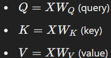
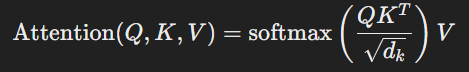
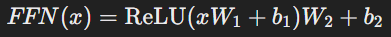
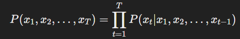
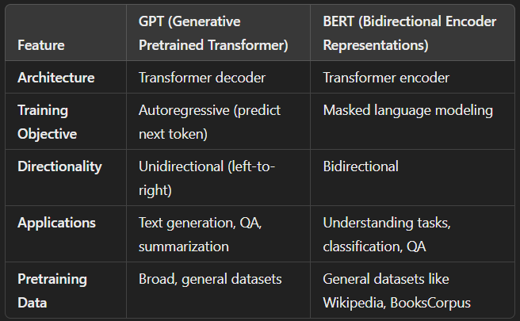
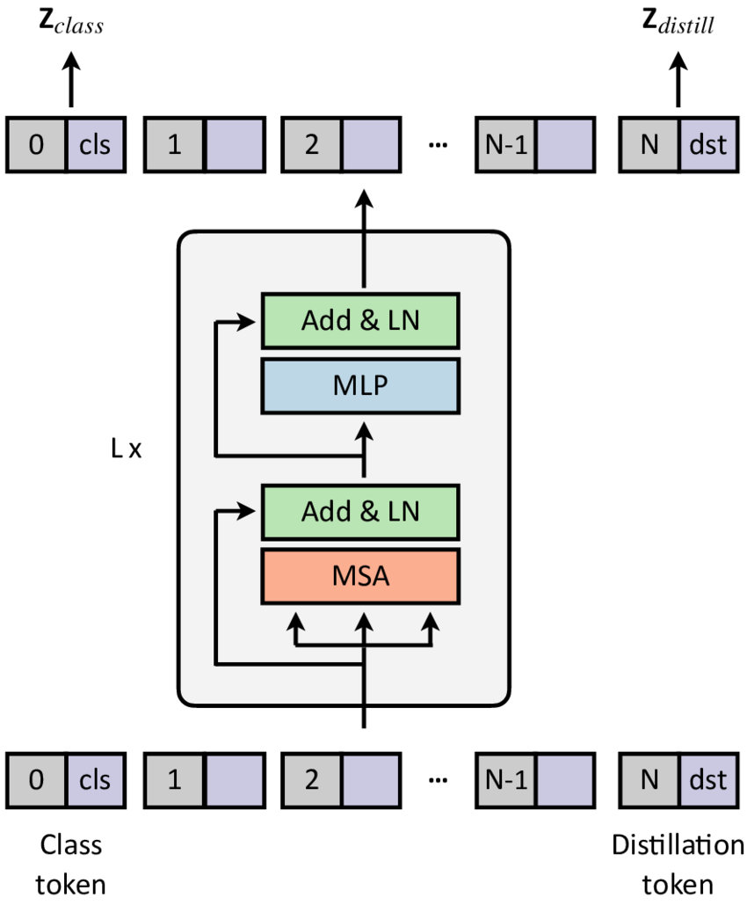
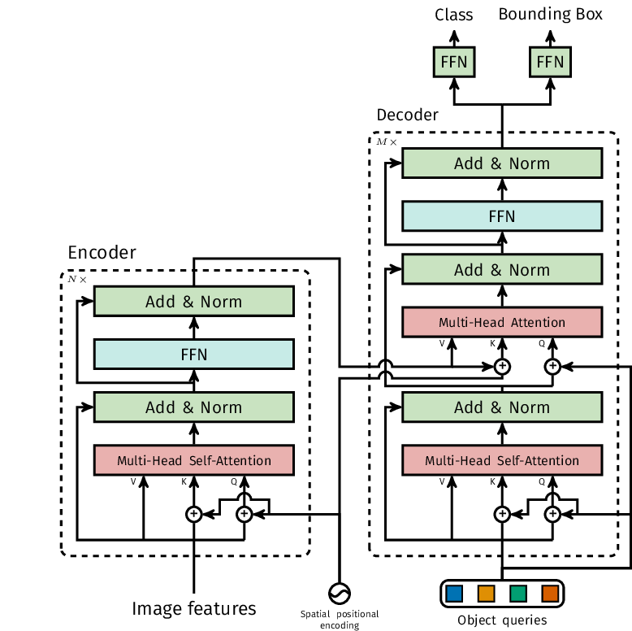
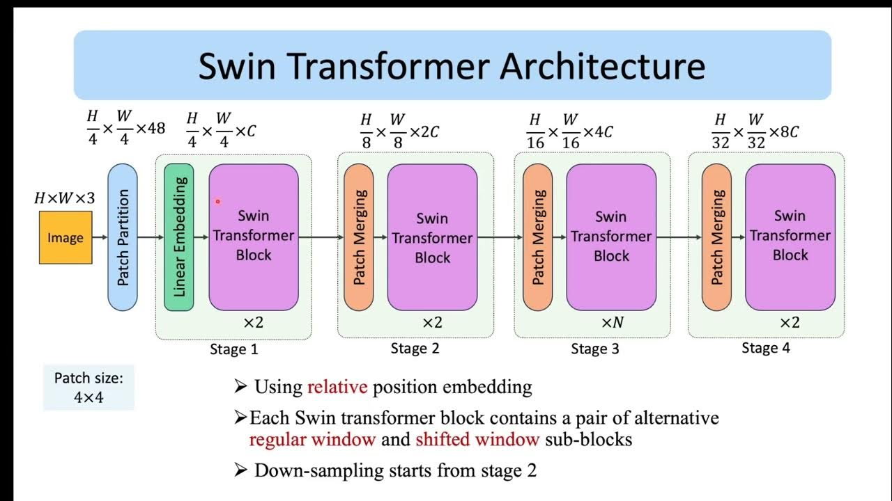

# 1. Vanilla Transformer
A vanilla transformer, introduced in the paper "Attention is all you need" (2017), is a neural network architecture that revolutionized deep learning, especially in NLP.Unlike its predecessors (e.g., recurrent neural networks or convolutional sequence models), the transformer is built entirely on the self-attention mechanism, which allows it to process sequential data with unprecedented efficiency and flexibility.

#
### **Key Innovations of Vanilla Transformer**
#
The vanilla transformer has three major innovations that set it apart:

1. **Self-Attention Mechanism:**
- Instead of processing sequential data one step at a time (like RNNs), transformers consider all elements of the sequence simultaneously.

- Each element in the sequence attends to every other element, creating a global understanding of the sequence.

2. **Positional Encoding:**
- Transformers are inherently order-agnostic since they process sequences in parallel.

- To preserve the sequential structure of the input, positional encodings are added to the embeddings, enabling the model to learn the order of tokens.

3. **Parallelization:**

- Unlike RNNs, transformers process the entire sequence in parallel, leveraging modern GPU architectures for faster training.

#
### **Transformer Architecture**
#

The transformer consists of two main components: the encoder and the decoder.

1. Encoder

- The encoder's role is to process the input sequence and create contextualized representations for each token.
- It consists of N identical layers, with each layer comprising:

    A. Multi-Head Self-Attention:
    - Computes attention scores between all tokens in the input.
    - Generates weighted combinations of input tokens to focus on the most relevant parts.

    B. Feedforward Neural Network (FFN):
    - Applies a two-layer fully connected network with non-linear activation.

    C. Add & Norm:
    - Residual connections and layer normalization are applied after each sub-layer.

2. Decoder

- The decoder generates the output sequence, one token at a time.
- Like the encoder, it consists of N identical layers, with an additional layer for attention over the encoder outputs:

    A. Masked Multi-Head Self-Attention:
    - Prevents the decoder from attending to future positions (causality).

    B.Encoder-Decoder Attention:
    - Computes attention over the encoder's output, allowing the decoder to focus on relevant input tokens.

    C. Feedforward Neural Network (FFN).

    D. Add & Norm layers, as in the encoder.

3. Embeddings

- Both the encoder and decoder embed their inputs into continuous vector spaces using learnable embedding layers.
- Positional encodings are added to these embeddings to incorporate sequence order.

4. Output Layer

- The decoder's final output is passed through a linear layer followed by a softmax to predict the next token in the sequence.

#
### **Mathematical Foundations**
#

#### Self-Attention Mechanism
The self-attention mechanism computes a weighted representation for each token in the sequence. For an input sequence X of dimension d:

1. Compute three learned projections:

    

2. Compute attention Scores:

    

3. Use multi-head attention:
- Multiple attention heads compute independent attention scores.
- Outputs are concatenated and projected back to the original dimension.

#### Feedforward Network
- After self-attention, a feedforward network (FPN) applies two linear transformations with a non-linear activation in between:

    

#
### **Applications of Vanilla Transformer**
#

The vanilla transformer is a general-purpose architecture, adaptable to a wide range of tasks across multiple domains.

- Image Captioning:

    Vanilla transformers have been adapted for image-to-text tasks, combining CNNs for feature extraction with transformers for sequence generation.

- Object Detection:
    Models like DETR (Detection Transformer) use transformers for object localization and classification.

#
### **Strengths of Vanilla Transformer**
#

- The self-attention mechanism allows the model to capture relationships across the entire input sequence.
- Unlike RNNs, transformers process sequences in parallel, leading to faster training times.
- Encoder and decoder components are independent and reusable for a variety of tasks.
- With minor adaptations, transformers can be used across vision, text, speech, and more.

#
### **Limitations of Vanilla Transformer**
- The self-attention mechanism scales quadratically with sequence length, making it expensive for long sequences.
- Transformers require massive amounts of data to train effectively, especially for tasks with long dependencies.
- Transformers consume significant memory during training due to their large parameter count.

#

Many models have built upon the vanilla transformer architecture to address its limitations and expand its applications:

1. BERT (Bidirectional Encoder Representations from Transformers) for pretraining in NLP.
2. GPT (Generative Pretrained Transformer) for text generation.
3. ViT (Vision Transformer) for computer vision tasks.
4. DETR (Detection Transformer) for object detection.
5. Swin Transformer for efficient attention mechanisms in vision.

#

# 2. GPT

GPT (Generative Pretrained Transformer), developed by OpenAI, is a family of transformer-based models designed primarily for text generation. GPT's unique strength lies in its ability to generate coherent and contextually relevant text by training on vast corpora of textual data using a generative language modeling approach. Since its inception, GPT has evolved through several iterations, with each version improving on performance, scale, and generalization capabilities.

#
### What is GPT?
#
GPT is an autoregressive transformer model that generates text token by token. Unlike BERT, which is bidirectional, GPT processes text in a unidirectional manner (left-to-right), focusing on predicting the next word based on the context of previous words.

#
### Key Features of GPT
#

1. Autoregressive Language Modeling:
- GPT predicts the next token in a sequence, enabling natural and fluent text generation.

2. Pretraining and Fine-tuning Paradigm:
- Pretraining: GPT is trained on large unlabeled datasets to predict the next word in a sequence.
- Fine-tuning: For specific tasks, GPT can be fine-tuned on smaller, labeled datasets.

3. Transformer-based Architecture:
- Built on the transformer decoder, GPT captures long-range dependencies in text while generating sequentially.

4. Scalability:
- GPT has progressively scaled in model size, dataset size, and computational power, with notable versions like GPT, GPT-2, and GPT-3.

5. Zero-shot and Few-shot Learning:
- GPT-3 introduced the ability to perform tasks without fine-tuning by providing task instructions directly in the input.

#
### Architecture of GPT
#

GPT is based on the transformer decoder architecture and differs from BERT, which uses the transformer encoder.

A. Input Representation
1. Token Embeddings:
- Converts input text into token IDs, which are embedded into dense vectors.
2. Positional Embeddings:
- Adds positional information to token embeddings to encode sequence order.

B. Transformer Decoder

GPT's architecture consists of a stack of identical transformer decoder blocks, each containing:
1. Masked Multi-Head Self-Attention:
- Prevents the model from attending to future tokens (causality).
- Only looks at tokens to the left of the current position.
2. Feedforward Neural Network (FFN):
Applies two linear transformations with non-linear activation.
3. Add & Norm:
- Residual connections and layer normalization stabilize learning.

C. Output Layer
- The final output is a probability distribution over the vocabulary, predicting the next token.

#
### Pretraining Objective
#
GPT uses autoregressive language modeling (causal LM):

1. Given a sequence of tokens x1, x2, ....,xT, GPT learns to maximize:

    

2. It predicts each token xt based on all preceding tokens.

#
### Evolution of GPT Models
#

1. GPT (2018):
- Introduced as a transformer decoder trained on BooksCorpus.
- Demonstrated the potential of pretrained language models for downstream tasks.

2. GPT-2 (2019):
- Expanded to 1.5 billion parameters.
- Trained on a broader dataset of 40GB, capable of generating human-like text.
- Controversially not released immediately due to concerns about misuse.

3. GPT-3 (2020):
- Massive scale with 175 billion parameters.
- Pioneered zero-shot and few-shot learning.
- Requires no task-specific fine-tuning—tasks can be performed by providing instructions in the prompt.

4. ChatGPT (2022):
- Fine-tuned version of GPT-3.5/GPT-4 with Reinforcement Learning from Human Feedback (RLHF) for conversational tasks.

5. GPT-4 (2023):
- Multimodal capabilities: processes text and images.
- Improved reasoning, coherence, and contextual understanding.

#
### Applications of GPT
#
A. Text Generation
1. Creative Writing:
- Stories, poetry, and song lyrics.
2. Content Creation:
- Blog posts, essays, and social media captions.

B. Conversational AI

- Used in chatbots and virtual assistants to generate human-like responses.
- Example: ChatGPT.

C. Code Generation

- Assists in generating code snippets, debugging, and explaining code.

D. Question Answering

- Provides accurate answers based on context or knowledge.

E. Translation

- Translates between languages using contextual understanding.

F. Summarization

- Condenses long texts into concise summaries.

G. Text Completion

- Autocompletes sentences or paragraphs based on partial input.

H. Sentiment Analysis

- Classifies text as positive, negative, or neutral.

#
### Strengths of GPT
#

- Generates highly coherent and contextually relevant text.
- With zero-shot and few-shot learning, GPT handles a wide range of tasks without fine-tuning.
- Larger models perform better, leveraging massive datasets and compute resources.
- Works across multiple domains, from creative writing to programming.

#
### Limitations
#
- Training and inference require substantial computational power and memory.
- Reflects biases present in its training data, leading to potential ethical concerns.
- Tends to generate plausible-sounding but incorrect or nonsensical responses.
- Can only handle a fixed number of tokens (e.g., 2048 tokens for GPT-3).
- Does not update its knowledge post-training, making it unaware of recent events.

#
### Comparison: GPT vs BERT
#

# 3. DeiT

DeiT (Data-efficient Image Transformer) is a vision transformer introduced by Facebook AI in the 2021 paper "Training data-efficient image transformers & distillation through attention". It addresses the data-hungry nature of Vision Transformers (ViTs) by improving training efficiency, allowing transformers to perform well even on smaller datasets like ImageNet, without the need for massive pretraining on large-scale datasets.

#
### 1. What is DeiT?
#

DeiT is a Vision Transformer (ViT) variant designed to improve data efficiency and training stability. By integrating knowledge distillation directly into the transformer architecture, DeiT achieves competitive performance with CNNs on image classification tasks while retaining the advantages of transformers.

#
### Key Features of DeiT
#

1. Data Efficiency:
- Unlike the original ViT, which requires hundreds of millions of images for pretraining, DeiT performs well on smaller datasets like ImageNet (1.2M images).

2. Knowledge Distillation with Attention:
- Introduces a distillation token alongside the class token.
- Learns from a teacher network (e.g., a CNN) while being trained on labeled data.

3. Pure Transformer Architecture:
- Fully transformer-based, with no reliance on convolutional layers.

4. Flexibility:
- Scales well across different model sizes (tiny, small, and base versions).

5. Competitive Performance:
- Matches or surpasses the performance of CNNs like ResNet and EfficientNet on image classification benchmarks.

#
### Architecture of DeiT
#

DeiT builds on the Vision Transformer (ViT) architecture but introduces modifications for better data efficiency:

A. Input Pipeline
1. Patch Embedding:
    - Input image is split into patches (e.g., 16x16 pixels).
    - Each patch is flattened and passed through a linear projection layer to produce patch embeddings.

2. Positional Encoding:
    - Positional embeddings are added to the patch embeddings to encode spatial information.

3. Distillation Token:
    - Adds a distillation token alongside the class token.
    - The class token predicts image classes, while the distillation token learns from the teacher network.

B. Transformer Encoder
Consists of multiple layers, each with:

1. Multi-Head Self-Attention (MHSA):
    - Captures relationships across patches.
2. Feedforward Network (FFN):
    - Applies non-linear transformations.
3. Layer Normalization and residual connections for stable training.

C. Output Heads
- Class Token Output:
    - Predicts the class of the input image.
- Distillation Token Output:
    - Matches the teacher model's outputs during training, improving generalization.

#
### Key Innovations
#

1. Distillation Token:
- Unlike traditional knowledge distillation methods, which use teacher outputs as soft labels, DeiT introduces a dedicated distillation token in the transformer architecture.

- The distillation token learns to mimic the teacher model’s predictions, providing additional supervision.

2. Improved Data Efficiency:
- Optimized training strategies (e.g., augmentations and regularizations) enable DeiT to achieve high accuracy on datasets like ImageNet without the need for pretraining on extremely large datasets.

#
### Deit Variants
#

1. DeiT-Tiny:
DeiT offers several model sizes to balance computational efficiency and performance:

1. DeiT-Tiny:
- Smallest model, suitable for lightweight applications.
- ~5 million parameters.

2. DeiT-Small:
- Mid-sized model, offering a balance between speed and accuracy.
- ~22 million parameters.

3. DeiT-Base:
- Larger model with higher accuracy, similar to the original ViT.
- ~86 million parameters.

#
### Applications of DeiT
#

DeiT is primarily used for image classification but can also serve as a backbone for various computer vision tasks:

A. Image Classification
- Example: Object recognition tasks on ImageNet, CIFAR-10, and more.

B. Transfer Learning
- Pretrained DeiT models can be fine-tuned on downstream tasks like medical imaging, satellite image analysis, and document classification.

C. Object Detection

- Used as a feature extractor in detection frameworks like DETR (Detection Transformer).

D. Semantic Segmentation

- Serves as a backbone for transformer-based segmentation models.

E. Lightweight Vision Tasks
- Smaller variants like DeiT-Tiny are suitable for edge devices or resource-constrained environments.

#
### Strengths 
#
- Performs well with smaller datasets, reducing the dependency on massive pretraining.
- Fully transformer-based, with minimal reliance on task-specific components.
- Seamlessly integrates knowledge distillation into the architecture, enhancing generalization.
- Flexible across different compute budgets and task requirements (e.g., DeiT-Tiny to DeiT-Base).
- Matches or surpasses state-of-the-art CNNs like ResNet and EfficientNet.

#
### Limitations
#
- Despite improvements, training transformers is generally more computationally expensive than CNNs.
- Fixed-size patches may not capture fine-grained features as effectively as convolutional layers.
- Relies heavily on data augmentations like Mixup, CutMix, and RandAugment to achieve peak performance.

# 4. DETR

DETR (Detection Transformer) is a groundbreaking architecture introduced by Facebook AI in the 2020 paper "End-to-End Object Detection with Transformers". It reimagines object detection by leveraging transformers, eliminating traditional components like anchor boxes and region proposal networks (RPNs). DETR represents object detection as a set prediction problem, simplifying the pipeline while achieving robust performance.

#
### Key Features of DETR
#
1. End-to-End Object Detection:
- DETR bypasses conventional object detection techniques like anchor generation and non-maximum suppression (NMS).
- Outputs a fixed-size set of predictions directly: bounding boxes and class labels.

2. Transformers for Vision:
- Utilizes a transformer encoder-decoder to model relationships between objects in the entire image.

3. Set Prediction Loss:
- Introduces a bipartite matching loss to assign predicted objects uniquely to ground-truth objects, enabling one-to-one correspondence.

4. Simpler Design:
- Unlike traditional models (e.g., Faster R-CNN), DETR has a simpler architecture, making it easier to train and extend.

5. Global Context:
- The self-attention mechanism in transformers captures relationships across the entire image, leading to better performance in crowded scenes or with overlapping objects.

#
### DETR Architecture
#

The architecture of DETR consists of three main components:

A. Backbone

- A Convolutional Neural Network (CNN) (e.g., ResNet-50 or ResNet-101) extracts feature maps from the input image.
- The feature map serves as the input to the transformer encoder.

B. Transformer Encoder-Decoder

1. Encoder:
- Processes the feature map as a sequence of patches.
- Applies multi-head self-attention to encode global relationships.

2. Decoder:
- Learns to predict object representations by decoding query embeddings.
- Each query corresponds to a potential object in the image.

C. Prediction Heads
- The decoder outputs are passed through simple feedforward networks (FFNs) to predict:
    1. Bounding Boxes: Normalized coordinates for object localization.
    2. Class Labels: Object category or "no object."

#
### Key Innovations
#

1. Set Prediction as Object Detection:
- DETR views object detection as a direct set prediction problem.
- Predicts a fixed number of objects (e.g., 100 predictions per image) and assigns each to a ground-truth object using bipartite matching.

2. Bipartite Matching Loss:
- Combines a Hungarian algorithm for matching predictions with ground truth and a loss function that includes:
    - Classification loss (e.g., cross-entropy).
    - Bounding box loss (L1 loss + GIoU loss).

3. Positional Embeddings:
- Encodes spatial information to help the transformer understand the arrangement of objects in the image.

#
### Applications of DETR
#

A. Object Detection

- Detects and classifies objects in images.
- Example: Autonomous vehicles detecting pedestrians, vehicles, and road signs.

B. Panoptic Segmentation
- Extends DETR to include segmentation masks for each detected object.
- Example: Scene understanding in robotics and medical imaging.

C. Multi-Object Tracking
- Tracks objects across video frames by associating detections with unique IDs.

D. Dense Prediction Tasks
- Applications like keypoint detection, anomaly detection, and more.

#
### Strengths
#
- Removes the need for handcrafted heuristics like anchor boxes or NMS.
- Models relationships across the entire image using self-attention.
- Supports tasks like object detection, segmentation, and keypoint prediction in a single framework.
- Handles crowded scenes more effectively than traditional detectors.

#
### Limitations
#
- Requires significant computational resources and training time to converge.
- Always predicts a fixed number of objects (e.g., 100), even for images with fewer objects.
- Struggles with small-scale objects compared to feature pyramid-based methods like Faster R-CNN.

#
### Variants of DETR
#
1. Deformable DETR:
- Introduces deformable attention to improve efficiency and better handle small objects.

2. DAB-DETR:
- Enhances the decoder by using dynamically adjusted bounding boxes as queries.

3. Conditional DETR:
- Simplifies the training process, accelerating convergence.

4. Efficient DETR:
- Optimizes the architecture for faster inference and lower computational cost.

# 5.Swin Transformer
Swin Transformer (Shifted Window Transformer) is a vision transformer architecture introduced by Microsoft in the paper "Swin Transformer: Hierarchical Vision Transformer using Shifted Windows" (2021). It addresses the inefficiencies of traditional Vision Transformers (ViTs), particularly for dense prediction tasks like object detection, instance segmentation, and semantic segmentation. The Swin Transformer introduces hierarchical feature representation and shifted window attention to efficiently process high-resolution images.

#
### What is Swin Transformer?
#

The Swin Transformer is a hierarchical Vision Transformer designed to be a general-purpose backbone for computer vision tasks. It uses shifted window-based self-attention, which allows it to balance computational efficiency with global context modeling, making it suitable for tasks requiring high-resolution images or dense outputs.

#
### Key Features of Swin Transformer 
#
1. Hierarchical Representation:
- Unlike the flat structure of ViTs, the Swin Transformer builds a feature hierarchy, similar to CNNs, enabling multi-scale processing.

2. Shifted Window Attention:
- Attention is computed within non-overlapping windows.
- To capture cross-window relationships,window are shifted at alternating layers.

3. Linear Computational Complexity:
- By limiting self-attention to local windows, the computational complexity grows linearly with image size, unlike the quadratic complexity in vanilla ViTs.

4. Versatility:
- Works effectively as a backbone for various tasks, including image classification, object detection, and semantic segmentation.

5. Compatibility:
- Can seamlessly replace CNN-based backbones (e.g., ResNet) in existing vision frameworks like Mask R-CNN.

#
### Swin Transformer Architecture
#

The Swin Transformer builds on the Vision Transformer (ViT) architecture but introduces key innovations like window-based self-attention and hierarchical feature extraction.

A. Input Processing
1. Patch Partitioning:
- Input images are divided into non-overlapping patches (e.g., 
4×4 pixels per patch).
- Each patch is linearly projected into an embedding vector.

2. Hierarchical Feature Representation:
- The architecture progressively reduces the spatial resolution of feature maps (like a CNN), capturing fine-to-coarse features.

B. Window-Based Self-Attention
- Key Idea:
    - Instead of computing self-attention globally (as in ViTs), the Swin Transformer divides the feature map into local windows.
    -  Each window is treated as a "mini-image," and self-attention is computed within the window.
- Shifted Windows:
    - To enable cross-window interaction, the windows are shifted by a fixed offset (e.g., half the window size) at alternating layers.
    - This mechanism allows information to flow between adjacent windows without introducing significant computational overhead.
C. Patch Merging
- After a few layers, adjacent patches are merged (like pooling in CNNs) to reduce spatial resolution and increase feature dimensionality.

D. Swin Transformer Block
Each Swin Transformer block consists of:

1. Window-based Multi-Head Self-Attention (W-MSA):
- Applies self-attention within local windows.
2. Shifted Window Multi-Head Self-Attention (SW-MSA):
- Alternates with W-MSA, using shifted windows for cross-window attention.
3. Feedforward Neural Network (FFN):
- Two-layer MLP with a GELU activation function.
4. Layer Normalization and Residual Connections:
- Used for stable training.

E. Output Head
- For image classification, the output is pooled and passed through a fully connected layer.
- For dense prediction tasks, the hierarchical feature maps are fed into task-specific heads (e.g., detection or segmentation heads).

#
### Variants of Swin Transformer
#
Swin Transformer comes in multiple sizes to balance performance and computational efficiency:

1. Swin-T (Tiny):
Lightweight model for resource-constrained scenarios.

2. Swin-S (Small):
Mid-sized model with a balance between speed and accuracy.

3. Swin-B (Base):
Larger model suitable for high-performance applications.

4. Swin-L (Large):
Largest model for tasks requiring maximum accuracy.

#
### Key Innovations
#
1. Window-Based Attention:
- Reduces computational cost while maintaining local context.

2. Shifted Windows:
- Ensures connections between patches across windows, addressing the local nature of window attention.

3. Hierarchical Feature Maps:
- Mimics the pyramid-like structure of CNNs, making it suitable for dense prediction tasks.

4. Linear Complexity:
- By restricting attention computation to windows, Swin achieves linear complexity with respect to image size.

#
### Applications of Swin Transformer
#
A. Image Classification
B. Object Detection
C. Semantic Segmentation
D. Instance and Panoptic Segmentation 
E. Video Understanding
F. Medical Imaging
G. Autonomous Vehicles

#
### Strengths
#
- Handles large images efficiently with window-based attention.
- Provides multi-scale feature representation, making it compatible with dense prediction tasks.
- Can replace CNN backbones in existing architectures without significant modifications.
- Offers multiple model sizes to suit different compute budgets.

#
### Limitations
#
- The shifted window mechanism adds complexity compared to standard ViTs.
- Performance improves significantly with large-scale pretraining.
- Despite shifted windows, some global relationships may require additional modeling techniques.

